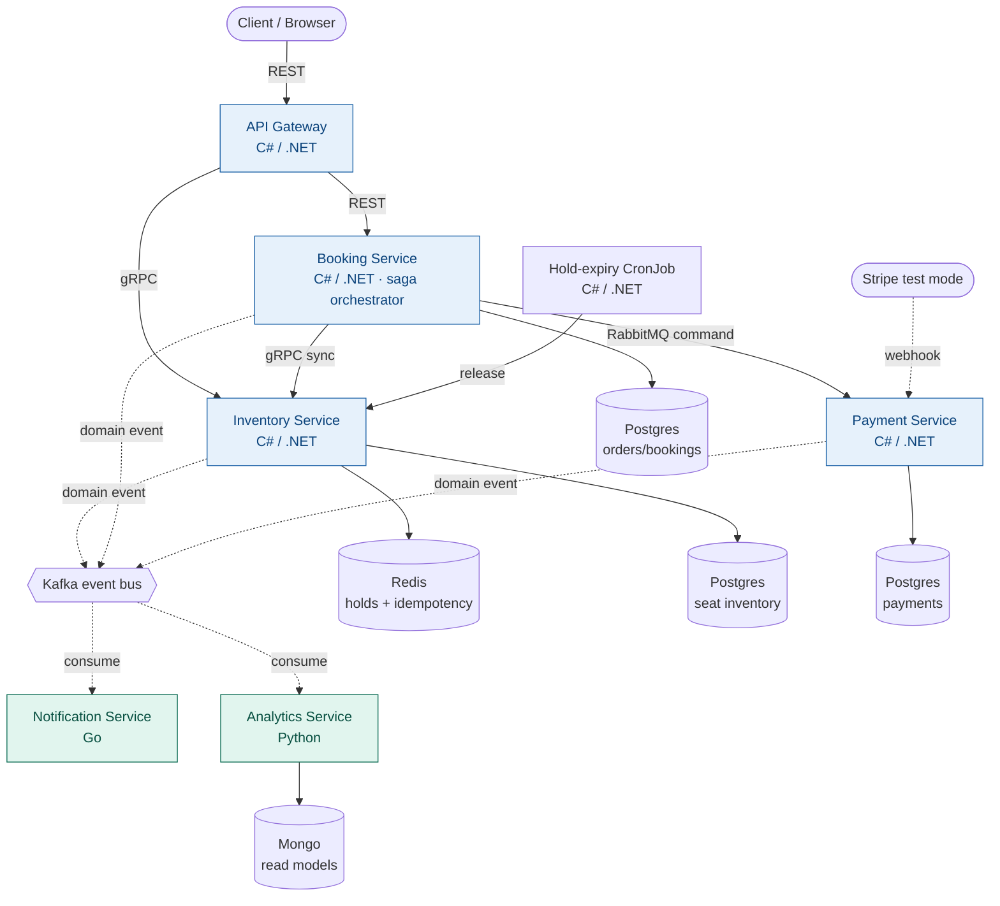

# Live Event Ticketing Platform — System Design

A microservices learning project: a reserved-seat ticketing platform for live events (concerts, theatre), built to practise software design, polyglot service communication, and Docker/Kubernetes. Mostly C#/.NET, with two services deliberately written in other languages so you learn cross-language communication.

---

## 1. What the system is

A platform where a customer buys **specific seats** for a **specific dated performance** of a live event, confirmed by a completed payment. Reserved seating (not general admission) is a deliberate choice — a named seat is a distinct, contended resource, which is what creates the interesting concurrency and inventory-design problems.

### Domain vocabulary

Naming is design, so these terms are precise and used consistently everywhere:

- **Event** — the show or artist (e.g. "Radiohead").
- **Performance** — a specific dated instance of an event at a venue ("Radiohead, Wembley, 2026-08-14, 20:00"). This is what customers book against.
- **Venue** — has a **seat map**: sections, rows, seats.
- **Seat inventory** — for each performance, every seat is `available`, `held`, or `sold`. This is the contended resource.
- **Hold** — a short-lived (≈10 minute) reservation with a TTL, created when a customer selects seats, so nobody else can take them mid-purchase.
- **Order** — a customer's intent to buy specific held seats.
- **Booking** — an order that has been paid for and confirmed.
- **Ticket** — issued per seat *after* payment succeeds.

**Definition of a booking:** one customer purchasing one or more specific seats for one performance, confirmed by a completed payment. The whole happy path follows from that sentence; everything hard is about what happens when a step in it fails.

---

## 2. Architecture at a glance

Solid arrows are synchronous (REST / gRPC); dashed arrows are asynchronous (RabbitMQ commands and Kafka events).

---

## 3. The services

Six services. The business core is in .NET; two services are pushed out to other languages where a different ecosystem genuinely fits, so the language boundary forces contract-first design.

### 3.1 API Gateway — C# / .NET

The single public entry point. Handles authentication, rate limiting, and request routing, and acts as an **anti-corruption layer** — it translates external client requests into internal contracts so client concerns never leak into the core services.

- **Communicates via:** receives REST from clients; calls Booking over REST and Inventory over gRPC.
- **Data store:** none (stateless).
- **Key patterns:** anti-corruption layer, edge concerns (auth, throttling), backend-for-frontend.

### 3.2 Booking Service — C# / .NET

The heart of the system: the **saga orchestrator**. It coordinates a booking from seat selection through payment to confirmation, and owns the compensating actions when a step fails (e.g. release the hold if payment fails). This is where most of the software-design learning lives.

- **Communicates via:** receives REST from the gateway; calls Inventory over gRPC; sends payment commands over RabbitMQ; publishes and consumes Kafka domain events.
- **Data store:** Postgres (orders, bookings, saga state).
- **Key patterns:** saga / process manager, orchestration, transactional outbox, idempotency.

### 3.3 Inventory / Seat Service — C# / .NET

Owns seat availability for each performance and the concurrency-critical operations: creating and releasing holds, and marking seats sold. This is the concurrency playground — two customers reaching for seat 14A at the same time.

- **Communicates via:** serves gRPC to the gateway and Booking; publishes Kafka events (`SeatHeld`, `SeatReleased`, `SeatSold`).
- **Data store:** Postgres (seat inventory, source of truth) + Redis (holds with TTL, idempotency keys).
- **Key patterns:** optimistic locking, short-lived holds with TTL, idempotent operations, bounded context isolation.

### 3.4 Payment Service — C# / .NET

Handles payments. Starts as a **mock** that simulates success/failure, then upgrades to **Stripe test mode** for real integration without real money. Receives a payment command, authorises the payment, and — critically — treats the asynchronous **webhook** as the authoritative result.

- **Communicates via:** consumes payment commands from RabbitMQ; receives inbound webhooks from Stripe (HTTP); publishes Kafka events (`PaymentSucceeded`, `PaymentFailed`).
- **Data store:** Postgres (payment records, idempotency keys).
- **Key patterns:** sync-request/async-confirmation, idempotency keys, authorise-then-capture, webhook verification.

### 3.5 Notification Service — Go *(polyglot service #1)*

A pure Kafka event consumer that "sends" emails/SMS (logged or faked). Chosen as the first polyglot service precisely because the domain is trivial — so the unfamiliar language never blocks you on business logic, and you focus entirely on cross-language event consumption. Produces a tiny (~15MB) container image, a nice contrast to a .NET one.

- **Communicates via:** consumes Kafka domain events only. No synchronous callers.
- **Data store:** optional small store for delivery log / dedup.
- **Key patterns:** idempotent consumer, at-least-once delivery, dead-letter handling.
- **Why Go:** small fast consumer, goroutine concurrency, minimal footprint.

### 3.6 Analytics Service — Python *(polyglot service #2)*

Consumes the same Kafka event stream to build read-optimised models ("tickets sold per performance", "revenue per event"). Built last, once the event schemas have stabilised. Justified by Python's data ecosystem (pandas, DuckDB, notebooks) and, pedagogically, by forcing your C# producers to publish events a completely different runtime can deserialize.

- **Communicates via:** consumes Kafka events; serves read models via its own REST endpoint.
- **Data store:** Mongo or a time-series store (read models, physically separate from the write side).
- **Key patterns:** CQRS-lite, event-driven read models, stream aggregation.
- **Why Python:** data/analytics ecosystem, exploratory tooling.

---

## 4. How the services communicate

The project deliberately uses several communication styles, each because the situation calls for it — not to tick a box.

### Synchronous — REST

Client → Gateway, and Gateway → Booking. The familiar baseline. Contract is an OpenAPI document, enforced only by convention and tests — worth having one hop like this so you feel how much weaker an unenforced contract is.

### Synchronous — gRPC

Gateway/Booking → Inventory. Internal, low-latency, strongly typed. The `.proto` file is the **shared source of truth** across C#, Go, and Python: you write it once and run the protobuf compiler per language, so neither side hand-writes serialization. Change a field and both sides fail to compile until fixed — the contract is enforced by codegen. These `.proto` files are your contract-design gym.

### Asynchronous — commands (RabbitMQ)

Booking → Payment: "process this payment." A **command** is a directed instruction to one specific handler (point-to-point, work-queue semantics, retries, dead-letter queues). Use **MassTransit** over RabbitMQ in .NET.

### Asynchronous — events (Kafka)

Domain events (`SeatSold`, `PaymentSucceeded`, `BookingConfirmed`) are published **once** and fanned out to multiple independent consumers (Notification and Analytics). An **event** is a broadcast fact — "this happened" — with no knowledge of who consumes it. Use `Confluent.Kafka` on the .NET side.

**The command-vs-event distinction is itself a core design lesson:** RabbitMQ for "do this" (one recipient), Kafka for "this happened" (many recipients).

### Scheduled — CronJob

A Kubernetes CronJob periodically tells Inventory to release holds whose TTL has lapsed. This is the "timeout" safety net for the booking saga.

### Contract-first, always

Across every channel, the artifact you're really designing is the **contract**, not the code. The `.proto` files and event schemas are the durable, valuable part; the service implementations are almost disposable. For Kafka events, start with JSON, feel it drift, then add Protobuf/Avro events plus a **schema registry** that versions schemas and rejects incompatible changes.

---

## 5. The booking + payment flow

### Happy path

1. Customer selects seats → Booking asks Inventory to **create a hold** (Redis, 10-min TTL). Seats become `held`.
2. Booking creates an **Order** and sends a **payment command** over RabbitMQ.
3. Payment **authorises** the payment (holds the funds via Stripe test mode) and waits.
4. Stripe calls back with a **webhook** — the authoritative result — and Payment publishes `PaymentSucceeded`.
5. The Booking saga consumes that event, tells Inventory to mark seats `sold`, **captures** the funds, confirms the **Booking**, and issues **Tickets**.
6. `BookingConfirmed` is published to Kafka; Notification emails the customer and Analytics updates its read models.

### Failure / compensation

If payment fails, or the hold times out before payment completes, the saga runs its **compensating action**: release the hold so the seats return to `available`. The CronJob covers the pure-timeout case independently.

### Payment design decisions (the real lessons)

- **Never touch real card numbers.** Handling raw card data means PCI-DSS compliance — avoid entirely. Use a mock service first, then Stripe *test mode* with test cards (e.g. `4242 4242 4242 4242` always succeeds).
- **The webhook is authoritative, not the sync response.** The immediate API response says "started"; the webhook says "done." A naive implementation that trusts the sync response will confirm bookings that later fail.
- **Authorise, then capture — two steps.** Authorise (hold funds) when you start; capture (take money) only after confirming the seat is still yours. If anything fails in between, release the authorisation and no money moves.
- **Idempotency keys are mandatory.** Networks retry. Without a key, a retry double-charges. Stripe accepts one directly; your own commands need the same discipline.
- **The hold TTL must outlive the payment window.** If the hold expires mid-payment you've sold a released seat — a classic bug the CronJob guards against.

### Saga states

`SeatsHeld → PaymentAuthorised → Confirmed`, with failure transitions `SeatsHeld → Released` and `PaymentAuthorised → Released` (plus refund/void of the authorisation). Model this explicitly with MassTransit's built-in **saga state machine** rather than tangled `if` statements.

---

## 6. Data and storage

**Database-per-service is a hard rule** — no shared database, ever. Services own their data and expose it only through their APIs and events.

- **Inventory:** Postgres (seat inventory, source of truth) + Redis (holds with TTL, idempotency keys).
- **Booking:** Postgres (orders, bookings, saga state).
- **Payment:** Postgres (payment records, idempotency keys).
- **Analytics:** Mongo or a time-series store (read models — a physically separate, read-optimised projection, which is the CQRS lesson).
- **Kafka** acts as the durable event log connecting the write side to the read side.

Polyglot persistence is intentional: each store is chosen for its job (relational for inventory integrity, Redis for TTL/speed, document/time-series for analytics).

---

## 7. Cross-cutting concerns

These separate a toy from a system. Each is a self-contained lesson worth practising deliberately.

- **Idempotency** — every command/event handler must survive being called twice without side effects.
- **Transactional outbox** — the fix for the dual-write problem (you can't reliably save to the DB *and* publish an event as two separate steps). Build it by hand once before letting MassTransit do it, so you understand what it solves.
- **Dead-letter queues** — where messages go after exhausting retries, so a poison message doesn't block the queue.
- **Circuit breakers** — between synchronous services, so a failing Inventory doesn't cascade. Use Polly in .NET.
- **Distributed tracing** — OpenTelemetry + Jaeger, so you can *see* a single request cross five services.
- **Structured logging + correlation IDs** — one ID flows through every hop of a request, across languages.
- **Graceful shutdown** — drain in-flight work before a pod dies, so a booking isn't lost on a restart.
- **Health probes** — liveness and readiness endpoints on every service for Kubernetes.

---

## 8. Cross-language contract gotchas

The things that "just work" between two C# services and quietly break across a language boundary. Each is a small, self-contained puzzle — and the whole reason to go polyglot.

- **Money and decimals.** C#'s `decimal` has no clean equivalent in Go or JSON. Represent money as **integer minor units** (`2500` = £25.00) everywhere it crosses the wire.
- **Dates and time zones.** Always cross the wire as **UTC ISO-8601 strings**. C# `DateTime`, Go `time.Time`, and Python `datetime` have different defaults for zone and precision.
- **Casing.** C# serializes `PascalCase` by default; the JSON/Go/Python world expects `camelCase` or `snake_case`. Configure the serializer explicitly — make naming a conscious contract decision.
- **Enums.** Send explicit strings or defined integer values; never rely on ordinal position, which the languages won't agree on.
- **Nullability / optional fields.** "Field is absent" differs across Protobuf defaults, JSON `null`, and C# nullable types. Decide and document it in the contract.

---

## 9. Kubernetes and deployment

Deploy to Kubernetes as soon as you have two services talking — living with pods over months teaches far more than a big-bang migration at the end.

- **Deployments** for each stateless service.
- **Services** for internal discovery/load-balancing.
- **Ingress** exposing only the API Gateway.
- **ConfigMaps / Secrets** for configuration and credentials (Stripe test keys, connection strings).
- **Liveness / readiness probes** on every service.
- **HorizontalPodAutoscaler** on Booking, so it scales under load — a good thing to load-test.
- **CronJob** for hold expiry.
- **StatefulSets** (or Helm charts / operators) for Postgres, Redis, Kafka, RabbitMQ in-cluster — or run those managed to start.

Everything runs in **Docker** first (Docker Compose for local dev), then the same images deploy to Kubernetes.

---

## 10. Phased roadmap

Build in layers. Do **not** attempt all six services and all patterns at once.

**Phase 1 — two services, REST only.** Booking + Inventory, one Postgres each, in Docker Compose. Focus purely on service boundaries and clean contracts.

**Phase 2 — real concurrency.** Seat holds in Redis with a TTL, idempotency keys. Deliberately try to double-book a seat with two concurrent requests, and fix the race. This is the core design lesson.

**Phase 3 — go async.** Add RabbitMQ (payment command) and Kafka (domain events) via MassTransit. Add the **Go Notification** consumer — your first cross-language hop. Hit at-least-once delivery, retries, DLQs for real.

**Phase 4 — the saga.** Rework Booking into a MassTransit saga state machine with compensating actions. Add the mock Payment service. This is where "software design" stops being theoretical.

**Phase 5 — Kubernetes + observability.** Deployments, Services, probes, Ingress, ConfigMaps/Secrets, the hold-expiry CronJob, an HPA on Booking, and OpenTelemetry + Jaeger tracing.

**Phase 6 — real payments + analytics.** Swap the mock for Stripe test mode (authorise/capture, webhooks, idempotency). Add the **Python Analytics** consumer last, once event schemas are stable.

**Stretch goals (long-term).** A service mesh (Linkerd) for mTLS and traffic-shifting; proper event sourcing for one aggregate; contract tests (Pact) so polyglot services can't silently break each other; a schema registry for Kafka events.

**Sequencing tip:** build the C# core first, add the Go consumer next, and add Python analytics last — by then your Kafka event schemas will have stabilised, so the cross-language consumer is a reward rather than a moving target.

---

## 11. Tech stack summary

| Service | Language | Communication | Data store | Signature pattern |
|---|---|---|---|---|
| API Gateway | C# / .NET | REST in, REST + gRPC out | none | Anti-corruption layer |
| Booking | C# / .NET | REST in, gRPC out, RabbitMQ + Kafka | Postgres | Saga orchestrator |
| Inventory | C# / .NET | gRPC in, Kafka out | Postgres + Redis | Optimistic locking, holds |
| Payment | C# / .NET | RabbitMQ in, webhook in, Kafka out | Postgres | Async confirmation, idempotency |
| Notification | Go | Kafka in | optional | Idempotent consumer |
| Analytics | Python | Kafka in, REST out | Mongo | CQRS read models |

**Core .NET libraries:** ASP.NET Core (REST), `Grpc.AspNetCore` (gRPC), MassTransit (RabbitMQ + saga state machine + outbox), `Confluent.Kafka` (events), EF Core + Npgsql (Postgres), StackExchange.Redis, Polly (resilience), `Stripe.net` (payments), OpenTelemetry.

**Infrastructure:** Docker + Docker Compose (local), Kubernetes (deploy), Postgres, Redis, Kafka, RabbitMQ, Jaeger.